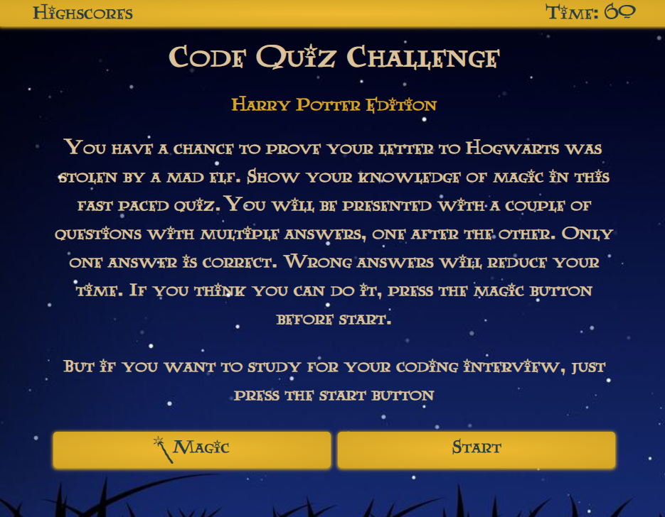
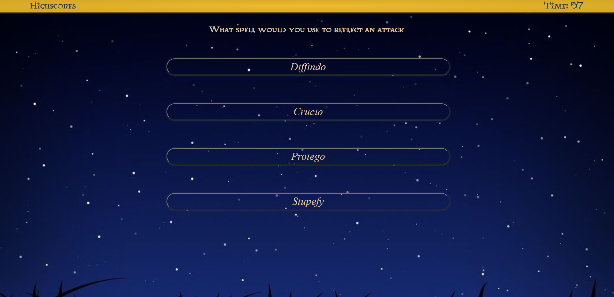
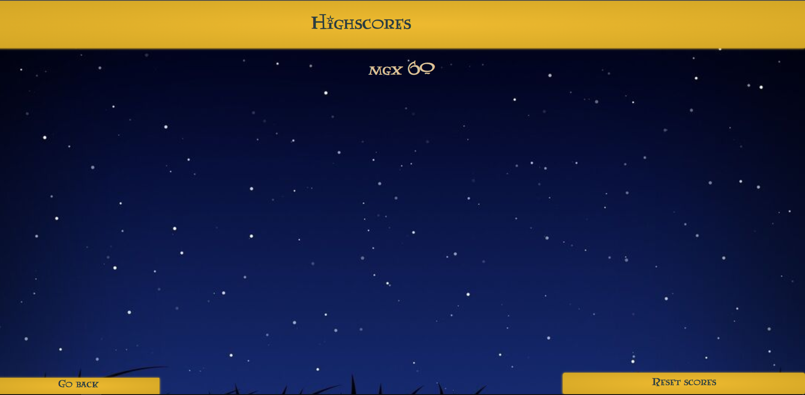

# Code Quiz

by Cesar San.

Contact me by Email: cesanchezesc@gmail.com

List of Technologies:

-HTML.

-CSS.

-Javascript.

Code Quiz is web based application of a game in which you have a limited time to answer correctly and get the highest score.

The task was to create a Quiz  Game to practice coding concepts using DOM APIs, Javascript, CSS and HTML.

I had the idea to make a Quiz webpage in which I could easily expand or exchange the content of the questions and answers in case I wanted to use the code in later projects. So I decided to choose another topic besides coding to practice this idea. That topic also helped me later to decide how i wanted the webpage to look and feel.
git
First I created the HTML structure using a couple of sections that will display or hide depending on the stage of the game. Then I started to work on the Javascript file by creating the arrays of objects I was going to use for the questions and answers. After coding that and the main variables I was going to use, I started with the functions for the timer and the game itself. When I was done, the rest of the time was adjusting bugs and making sure everything worked. Finally, I worked on the css for the format until everything was done. The rest of the time was spent on fixing bugs and adjusting the UI. 

 [Final Product:Github repository](https://github.com/csancheze/Code-Quiz)

 [Final Product:Code Quiz](https://csancheze.github.io/Code-Quiz/)

Copyright (c) [2022] [Cesar San]

Permission is hereby granted, free of charge, to any person obtaining a copy of this software and associated documentation files (the "Software"), to deal in the Software without restriction, including without limitation the rights to use, copy, modify, merge, publish, distribute, sublicense, and/or sell copies of the Software, and to permit persons to whom the Software is furnished to do so, subject to the following conditions:

The above copyright notice and this permission notice shall be included in all copies or substantial portions of the Software.

THE SOFTWARE IS PROVIDED "AS IS", WITHOUT WARRANTY OF ANY KIND, EXPRESS OR IMPLIED, INCLUDING BUT NOT LIMITED TO THE WARRANTIES OF MERCHANTABILITY, FITNESS FOR A PARTICULAR PURPOSE AND NONINFRINGEMENT. IN NO EVENT SHALL THE AUTHORS OR COPYRIGHT HOLDERS BE LIABLE FOR ANY CLAIM, DAMAGES OR OTHER LIABILITY, WHETHER IN AN ACTION OF CONTRACT, TORT OR OTHERWISE, ARISING FROM, OUT OF OR IN CONNECTION WITH THE SOFTWARE OR THE USE OR OTHER DEALINGS IN THE SOFTWARE.
